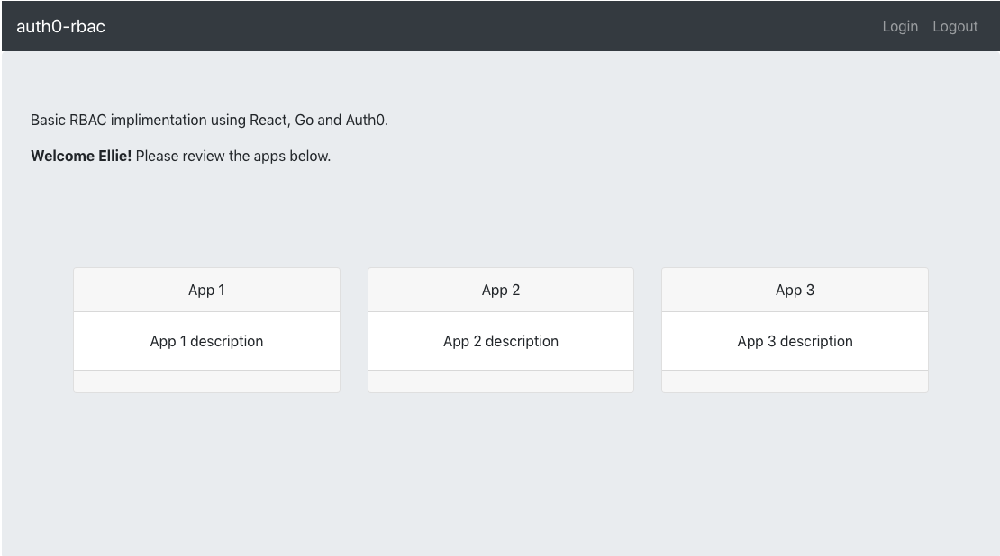

# slideshow-editor

Basic RBAC implimentation using React, Go and Auth0. Also requires https://github.com/jimareed/auth0-rbac-backend. Based on https://github.com/jimareed/react-auth0-login, the samples from Auth0 and the Auth0 blog: https://auth0.com/blog/authentication-in-golang/.

<p  align="center">
    
</p>


Config setup
1. create auth0 account
2. create app
3. set Allowed Callback URLs and Allowed Logout URLs and Allowed Web Origins to http://localhost:3000

Initial setup
```
npm install
```

Run
```
export REACT_APP_DOMAIN=-- insert here --
export REACT_APP_CLIENTID=-- insert here -- 
export REACT_APP_AUDIENCE=-- insert here -- 
npm start
```

Follow the instructions to install and run the backend at: https://github.com/jimareed/auth0-react-backend

Open [http://localhost:3000](http://localhost:3000) to view it in the browser.

